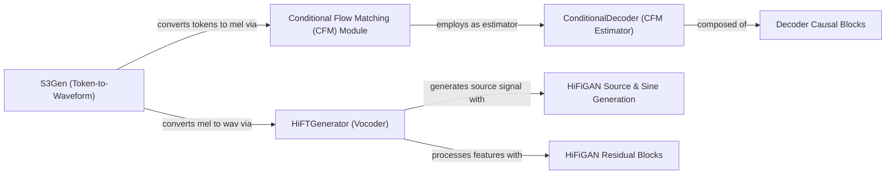

## Component Details

This graph describes the Audio Synthesis & Vocoding subsystem, focusing on the S3Gen model and its integration with the HiFi-GAN vocoder. The main flow involves converting speech tokens into mel spectrograms using Conditional Flow Matching, which employs a ConditionalDecoder as its estimator. Subsequently, these mel spectrograms are transformed into high-fidelity raw audio waveforms by the HiFTGenerator, which leverages HiFiGAN Source & Sine Generation and HiFiGAN Residual Blocks for robust audio synthesis.

### S3Gen (Token-to-Waveform)
The primary speech generation model, responsible for converting S3 speech tokens into raw audio waveforms. It combines a token-to-mel spectrogram conversion stage with a mel-to-waveform vocoder.

**Related Classes/Methods**:

- <a href="https://github.com/resemble-ai/chatterbox/blob/master/src/chatterbox/models/s3gen/s3gen.py#L219-L305" target="_blank" rel="noopener noreferrer">`chatterbox.src.chatterbox.models.s3gen.s3gen.S3Token2Wav` (219:305)</a>
- <a href="https://github.com/resemble-ai/chatterbox/blob/master/src/chatterbox/models/s3gen/s3gen.py#L226-L243" target="_blank" rel="noopener noreferrer">`chatterbox.src.chatterbox.models.s3gen.s3gen.S3Token2Wav:__init__` (226:243)</a>
- <a href="https://github.com/resemble-ai/chatterbox/blob/master/src/chatterbox/models/s3gen/s3gen.py#L245-L266" target="_blank" rel="noopener noreferrer">`chatterbox.src.chatterbox.models.s3gen.s3gen.S3Token2Wav:forward` (245:266)</a>
- <a href="https://github.com/resemble-ai/chatterbox/blob/master/src/chatterbox/models/s3gen/s3gen.py#L269-L279" target="_blank" rel="noopener noreferrer">`chatterbox.src.chatterbox.models.s3gen.s3gen.S3Token2Wav:flow_inference` (269:279)</a>
- <a href="https://github.com/resemble-ai/chatterbox/blob/master/src/chatterbox/models/s3gen/s3gen.py#L282-L285" target="_blank" rel="noopener noreferrer">`chatterbox.src.chatterbox.models.s3gen.s3gen.S3Token2Wav:hift_inference` (282:285)</a>
- <a href="https://github.com/resemble-ai/chatterbox/blob/master/src/chatterbox/models/s3gen/s3gen.py#L288-L305" target="_blank" rel="noopener noreferrer">`chatterbox.src.chatterbox.models.s3gen.s3gen.S3Token2Wav:inference` (288:305)</a>
- <a href="https://github.com/resemble-ai/chatterbox/blob/master/src/chatterbox/models/s3gen/s3gen.py#L47-L216" target="_blank" rel="noopener noreferrer">`chatterbox.src.chatterbox.models.s3gen.s3gen.S3Token2Mel` (47:216)</a>
- <a href="https://github.com/resemble-ai/chatterbox/blob/master/src/chatterbox/models/s3gen/s3gen.py#L114-L164" target="_blank" rel="noopener noreferrer">`chatterbox.src.chatterbox.models.s3gen.s3gen.S3Token2Mel:embed_ref` (114:164)</a>
- <a href="https://github.com/resemble-ai/chatterbox/blob/master/src/chatterbox/models/s3gen/s3gen.py#L166-L216" target="_blank" rel="noopener noreferrer">`chatterbox.src.chatterbox.models.s3gen.s3gen.S3Token2Mel:forward` (166:216)</a>
- <a href="https://github.com/resemble-ai/chatterbox/blob/master/src/chatterbox/models/s3gen/s3gen.py#L43-L44" target="_blank" rel="noopener noreferrer">`chatterbox.src.chatterbox.models.s3gen.s3gen.get_resampler` (43:44)</a>

### Conditional Flow Matching (CFM) Module
Implements the conditional flow matching algorithm, a diffusion-based process used for generating mel-spectrograms from speech tokens and speaker embeddings.

**Related Classes/Methods**:

- <a href="https://github.com/resemble-ai/chatterbox/blob/master/src/chatterbox/models/s3gen/flow_matching.py#L31-L195" target="_blank" rel="noopener noreferrer">`chatterbox.src.chatterbox.models.s3gen.flow_matching.ConditionalCFM` (31:195)</a>
- <a href="https://github.com/resemble-ai/chatterbox/blob/master/src/chatterbox/models/s3gen/flow_matching.py#L48-L80" target="_blank" rel="noopener noreferrer">`chatterbox.src.chatterbox.models.s3gen.flow_matching.ConditionalCFM:forward` (48:80)</a>
- <a href="https://github.com/resemble-ai/chatterbox/blob/master/src/chatterbox/models/s3gen/flow_matching.py#L82-L133" target="_blank" rel="noopener noreferrer">`chatterbox.src.chatterbox.models.s3gen.flow_matching.ConditionalCFM:solve_euler` (82:133)</a>
- <a href="https://github.com/resemble-ai/chatterbox/blob/master/src/chatterbox/models/s3gen/flow_matching.py#L135-L154" target="_blank" rel="noopener noreferrer">`chatterbox.src.chatterbox.models.s3gen.flow_matching.ConditionalCFM:forward_estimator` (135:154)</a>
- <a href="https://github.com/resemble-ai/chatterbox/blob/master/src/chatterbox/models/s3gen/flow_matching.py#L198-L228" target="_blank" rel="noopener noreferrer">`chatterbox.src.chatterbox.models.s3gen.flow_matching.CausalConditionalCFM` (198:228)</a>
- <a href="https://github.com/resemble-ai/chatterbox/blob/master/src/chatterbox/models/s3gen/flow_matching.py#L199-L201" target="_blank" rel="noopener noreferrer">`chatterbox.src.chatterbox.models.s3gen.flow_matching.CausalConditionalCFM:__init__` (199:201)</a>
- <a href="https://github.com/resemble-ai/chatterbox/blob/master/src/chatterbox/models/s3gen/flow_matching.py#L204-L228" target="_blank" rel="noopener noreferrer">`chatterbox.src.chatterbox.models.s3gen.flow_matching.CausalConditionalCFM:forward` (204:228)</a>

### ConditionalDecoder (CFM Estimator)
A U-Net like neural network that serves as the estimator within the Conditional Flow Matching framework, predicting the flow for mel-spectrogram generation.

**Related Classes/Methods**:

- <a href="https://github.com/resemble-ai/chatterbox/blob/master/src/chatterbox/models/s3gen/decoder.py#L100-L317" target="_blank" rel="noopener noreferrer">`chatterbox.src.chatterbox.models.s3gen.decoder.ConditionalDecoder` (100:317)</a>
- <a href="https://github.com/resemble-ai/chatterbox/blob/master/src/chatterbox/models/s3gen/decoder.py#L101-L217" target="_blank" rel="noopener noreferrer">`chatterbox.src.chatterbox.models.s3gen.decoder.ConditionalDecoder:__init__` (101:217)</a>
- <a href="https://github.com/resemble-ai/chatterbox/blob/master/src/chatterbox/models/s3gen/decoder.py#L233-L317" target="_blank" rel="noopener noreferrer">`chatterbox.src.chatterbox.models.s3gen.decoder.ConditionalDecoder:forward` (233:317)</a>
- <a href="https://github.com/resemble-ai/chatterbox/blob/master/src/chatterbox/models/s3gen/decoder.py#L219-L231" target="_blank" rel="noopener noreferrer">`chatterbox.src.chatterbox.models.s3gen.decoder.ConditionalDecoder.initialize_weights` (219:231)</a>
- <a href="https://github.com/resemble-ai/chatterbox/blob/master/src/chatterbox/models/s3gen/decoder.py#L25-L33" target="_blank" rel="noopener noreferrer">`chatterbox.src.chatterbox.models.s3gen.decoder.mask_to_bias` (25:33)</a>

### HiFTGenerator (Vocoder)
A high-fidelity mel-to-waveform generator that synthesizes raw audio from mel-spectrograms, forming the final stage of speech synthesis.

**Related Classes/Methods**:

- <a href="https://github.com/resemble-ai/chatterbox/blob/master/src/chatterbox/models/s3gen/hifigan.py#L286-L474" target="_blank" rel="noopener noreferrer">`chatterbox.src.chatterbox.models.s3gen.hifigan.HiFTGenerator` (286:474)</a>
- <a href="https://github.com/resemble-ai/chatterbox/blob/master/src/chatterbox/models/s3gen/hifigan.py#L291-L380" target="_blank" rel="noopener noreferrer">`chatterbox.src.chatterbox.models.s3gen.hifigan.HiFTGenerator:__init__` (291:380)</a>
- <a href="https://github.com/resemble-ai/chatterbox/blob/master/src/chatterbox/models/s3gen/hifigan.py#L412-L444" target="_blank" rel="noopener noreferrer">`chatterbox.src.chatterbox.models.s3gen.hifigan.HiFTGenerator:decode` (412:444)</a>
- <a href="https://github.com/resemble-ai/chatterbox/blob/master/src/chatterbox/models/s3gen/hifigan.py#L446-L460" target="_blank" rel="noopener noreferrer">`chatterbox.src.chatterbox.models.s3gen.hifigan.HiFTGenerator:forward` (446:460)</a>
- <a href="https://github.com/resemble-ai/chatterbox/blob/master/src/chatterbox/models/s3gen/hifigan.py#L463-L474" target="_blank" rel="noopener noreferrer">`chatterbox.src.chatterbox.models.s3gen.hifigan.HiFTGenerator:inference` (463:474)</a>
- <a href="https://github.com/resemble-ai/chatterbox/blob/master/src/chatterbox/models/s3gen/hifigan.py#L396-L402" target="_blank" rel="noopener noreferrer">`chatterbox.src.chatterbox.models.s3gen.hifigan.HiFTGenerator._stft` (396:402)</a>
- <a href="https://github.com/resemble-ai/chatterbox/blob/master/src/chatterbox/models/s3gen/hifigan.py#L404-L410" target="_blank" rel="noopener noreferrer">`chatterbox.src.chatterbox.models.s3gen.hifigan.HiFTGenerator._istft` (404:410)</a>

### HiFiGAN Source & Sine Generation
Modules responsible for generating the fundamental frequency (F0) and harmonic/noise components that drive the HiFTGenerator vocoder.

**Related Classes/Methods**:

- <a href="https://github.com/resemble-ai/chatterbox/blob/master/src/chatterbox/models/s3gen/hifigan.py#L234-L283" target="_blank" rel="noopener noreferrer">`chatterbox.src.chatterbox.models.s3gen.hifigan.SourceModuleHnNSF` (234:283)</a>
- <a href="https://github.com/resemble-ai/chatterbox/blob/master/src/chatterbox/models/s3gen/hifigan.py#L252-L265" target="_blank" rel="noopener noreferrer">`chatterbox.src.chatterbox.models.s3gen.hifigan.SourceModuleHnNSF:__init__` (252:265)</a>
- <a href="https://github.com/resemble-ai/chatterbox/blob/master/src/chatterbox/models/s3gen/hifigan.py#L267-L283" target="_blank" rel="noopener noreferrer">`chatterbox.src.chatterbox.models.s3gen.hifigan.SourceModuleHnNSF:forward` (267:283)</a>
- <a href="https://github.com/resemble-ai/chatterbox/blob/master/src/chatterbox/models/s3gen/hifigan.py#L169-L231" target="_blank" rel="noopener noreferrer">`chatterbox.src.chatterbox.models.s3gen.hifigan.SineGen` (169:231)</a>
- <a href="https://github.com/resemble-ai/chatterbox/blob/master/src/chatterbox/models/s3gen/hifigan.py#L201-L231" target="_blank" rel="noopener noreferrer">`chatterbox.src.chatterbox.models.s3gen.hifigan.SineGen:forward` (201:231)</a>
- <a href="https://github.com/resemble-ai/chatterbox/blob/master/src/chatterbox/models/s3gen/hifigan.py#L195-L198" target="_blank" rel="noopener noreferrer">`chatterbox.src.chatterbox.models.s3gen.hifigan.SineGen._f02uv` (195:198)</a>

### Decoder Causal Blocks
Fundamental building blocks, including causal convolutional and residual blocks, used to construct the ConditionalDecoder for sequential data processing.

**Related Classes/Methods**:

- <a href="https://github.com/resemble-ai/chatterbox/blob/master/src/chatterbox/models/s3gen/decoder.py#L48-L61" target="_blank" rel="noopener noreferrer">`chatterbox.src.chatterbox.models.s3gen.decoder.CausalBlock1D` (48:61)</a>
- <a href="https://github.com/resemble-ai/chatterbox/blob/master/src/chatterbox/models/s3gen/decoder.py#L49-L57" target="_blank" rel="noopener noreferrer">`chatterbox.src.chatterbox.models.s3gen.decoder.CausalBlock1D:__init__` (49:57)</a>
- <a href="https://github.com/resemble-ai/chatterbox/blob/master/src/chatterbox/models/s3gen/decoder.py#L64-L68" target="_blank" rel="noopener noreferrer">`chatterbox.src.chatterbox.models.s3gen.decoder.CausalResnetBlock1D` (64:68)</a>
- <a href="https://github.com/resemble-ai/chatterbox/blob/master/src/chatterbox/models/s3gen/decoder.py#L65-L68" target="_blank" rel="noopener noreferrer">`chatterbox.src.chatterbox.models.s3gen.decoder.CausalResnetBlock1D:__init__` (65:68)</a>
- <a href="https://github.com/resemble-ai/chatterbox/blob/master/src/chatterbox/models/s3gen/decoder.py#L71-L97" target="_blank" rel="noopener noreferrer">`chatterbox.src.chatterbox.models.s3gen.decoder.CausalConv1d` (71:97)</a>
- <a href="https://github.com/resemble-ai/chatterbox/blob/master/src/chatterbox/models/s3gen/decoder.py#L37-L45" target="_blank" rel="noopener noreferrer">`chatterbox.src.chatterbox.models.s3gen.decoder.Transpose` (37:45)</a>

### HiFiGAN Residual Blocks
Residual blocks used within the HiFTGenerator to enhance feature processing and improve the quality of the synthesized audio.

**Related Classes/Methods**:

- <a href="https://github.com/resemble-ai/chatterbox/blob/master/src/chatterbox/models/s3gen/hifigan.py#L106-L166" target="_blank" rel="noopener noreferrer">`chatterbox.src.chatterbox.models.s3gen.hifigan.ResBlock` (106:166)</a>
- <a href="https://github.com/resemble-ai/chatterbox/blob/master/src/chatterbox/models/s3gen/hifigan.py#L108-L152" target="_blank" rel="noopener noreferrer">`chatterbox.src.chatterbox.models.s3gen.hifigan.ResBlock:__init__` (108:152)</a>
- <a href="https://github.com/resemble-ai/chatterbox/blob/master/src/chatterbox/models/s3gen/hifigan.py#L88-L89" target="_blank" rel="noopener noreferrer">`chatterbox.src.chatterbox.models.s3gen.hifigan.get_padding` (88:89)</a>
- <a href="https://github.com/resemble-ai/chatterbox/blob/master/src/chatterbox/models/s3gen/hifigan.py#L34-L84" target="_blank" rel="noopener noreferrer">`chatterbox.src.chatterbox.models.s3gen.hifigan.Snake` (34:84)</a>

### [FAQ](https://github.com/CodeBoarding/GeneratedOnBoardings/tree/main?tab=readme-ov-file#faq)