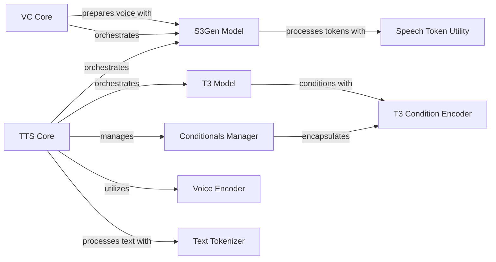

## Component Details

The Chatterbox Core Systems serve as the central orchestration layer for both Text-to-Speech and Voice Conversion processes. It manages the intricate flow between various model components, handling crucial operations such as model loading, conditioning, and the generation of speech from text or the conversion of voices. The system integrates specialized models like T3 for text-to-speech token conversion and S3Gen for token-to-waveform generation, supported by components for voice encoding, text tokenization, and conditional data management.

### TTS Core
The main Text-to-Speech synthesis component. It orchestrates the entire TTS process, from loading models and preparing conditional inputs to generating speech from text. It integrates various sub-models like T3, S3Gen, VoiceEncoder, and a tokenizer.

**Related Classes/Methods**:

- <a href="https://github.com/resemble-ai/chatterbox/blob/master/src/chatterbox/tts.py#L106-L266" target="_blank" rel="noopener noreferrer">`chatterbox.src.chatterbox.tts.ChatterboxTTS` (106:266)</a>
- <a href="https://github.com/resemble-ai/chatterbox/blob/master/src/chatterbox/tts.py#L129-L165" target="_blank" rel="noopener noreferrer">`chatterbox.src.chatterbox.tts.ChatterboxTTS:from_local` (129:165)</a>
- <a href="https://github.com/resemble-ai/chatterbox/blob/master/src/chatterbox/tts.py#L168-L180" target="_blank" rel="noopener noreferrer">`chatterbox.src.chatterbox.tts.ChatterboxTTS:from_pretrained` (168:180)</a>
- <a href="https://github.com/resemble-ai/chatterbox/blob/master/src/chatterbox/tts.py#L182-L206" target="_blank" rel="noopener noreferrer">`chatterbox.src.chatterbox.tts.ChatterboxTTS:prepare_conditionals` (182:206)</a>
- <a href="https://github.com/resemble-ai/chatterbox/blob/master/src/chatterbox/tts.py#L208-L266" target="_blank" rel="noopener noreferrer">`chatterbox.src.chatterbox.tts.ChatterboxTTS:generate` (208:266)</a>

### VC Core
The main Voice Conversion component. It handles the process of converting an input audio to a target voice. It primarily uses the S3Gen model and manages reference voice embeddings.

**Related Classes/Methods**:

- <a href="https://github.com/resemble-ai/chatterbox/blob/master/src/chatterbox/vc.py#L16-L104" target="_blank" rel="noopener noreferrer">`chatterbox.src.chatterbox.vc.ChatterboxVC` (16:104)</a>
- <a href="https://github.com/resemble-ai/chatterbox/blob/master/src/chatterbox/vc.py#L39-L59" target="_blank" rel="noopener noreferrer">`chatterbox.src.chatterbox.vc.ChatterboxVC:from_local` (39:59)</a>
- <a href="https://github.com/resemble-ai/chatterbox/blob/master/src/chatterbox/vc.py#L62-L74" target="_blank" rel="noopener noreferrer">`chatterbox.src.chatterbox.vc.ChatterboxVC:from_pretrained` (62:74)</a>
- <a href="https://github.com/resemble-ai/chatterbox/blob/master/src/chatterbox/vc.py#L76-L81" target="_blank" rel="noopener noreferrer">`chatterbox.src.chatterbox.vc.ChatterboxVC:set_target_voice` (76:81)</a>
- <a href="https://github.com/resemble-ai/chatterbox/blob/master/src/chatterbox/vc.py#L83-L104" target="_blank" rel="noopener noreferrer">`chatterbox.src.chatterbox.vc.ChatterboxVC:generate` (83:104)</a>

### Conditionals Manager
A data class that encapsulates all conditioning information required by the T3 and S3Gen models. It provides methods to move these conditions to a specified device and to load/save them.

**Related Classes/Methods**:

- <a href="https://github.com/resemble-ai/chatterbox/blob/master/src/chatterbox/tts.py#L65-L103" target="_blank" rel="noopener noreferrer">`chatterbox.src.chatterbox.tts.Conditionals` (65:103)</a>
- <a href="https://github.com/resemble-ai/chatterbox/blob/master/src/chatterbox/tts.py#L84-L89" target="_blank" rel="noopener noreferrer">`chatterbox.src.chatterbox.tts.Conditionals:to` (84:89)</a>
- <a href="https://github.com/resemble-ai/chatterbox/blob/master/src/chatterbox/tts.py#L99-L103" target="_blank" rel="noopener noreferrer">`chatterbox.src.chatterbox.tts.Conditionals:load` (99:103)</a>

### T3 Model
The Token-to-Token (T3) TTS model, which uses a Hugging Face transformer backbone. It's responsible for converting text tokens into speech tokens, incorporating various conditioning inputs like speaker embeddings and prompt speech tokens.

**Related Classes/Methods**:

- <a href="https://github.com/resemble-ai/chatterbox/blob/master/src/chatterbox/models/t3/t3.py#L37-L381" target="_blank" rel="noopener noreferrer">`chatterbox.src.chatterbox.models.t3.t3.T3` (37:381)</a>
- <a href="https://github.com/resemble-ai/chatterbox/blob/master/src/chatterbox/models/t3/t3.py#L210-L381" target="_blank" rel="noopener noreferrer">`chatterbox.src.chatterbox.models.t3.t3.T3:inference` (210:381)</a>
- <a href="https://github.com/resemble-ai/chatterbox/blob/master/src/chatterbox/models/t3/t3.py#L77-L84" target="_blank" rel="noopener noreferrer">`chatterbox.src.chatterbox.models.t3.t3.T3:prepare_conditioning` (77:84)</a>
- <a href="https://github.com/resemble-ai/chatterbox/blob/master/src/chatterbox/models/t3/t3.py#L86-L114" target="_blank" rel="noopener noreferrer">`chatterbox.src.chatterbox.models.t3.t3.T3:prepare_input_embeds` (86:114)</a>

### T3 Condition Encoder
Handles the encoding of non-text conditioning data for the T3 model, such as speaker embeddings, CLAP embeddings, and emotion. It projects these inputs into the model's hidden size.

**Related Classes/Methods**:

- <a href="https://github.com/resemble-ai/chatterbox/blob/master/src/chatterbox/models/t3/modules/cond_enc.py#L12-L38" target="_blank" rel="noopener noreferrer">`chatterbox.src.chatterbox.models.t3.modules.cond_enc.T3Cond` (12:38)</a>
- <a href="https://github.com/resemble-ai/chatterbox/blob/master/src/chatterbox/models/t3/modules/cond_enc.py#L24-L30" target="_blank" rel="noopener noreferrer">`chatterbox.src.chatterbox.models.t3.modules.cond_enc.T3Cond:to` (24:30)</a>
- <a href="https://github.com/resemble-ai/chatterbox/blob/master/src/chatterbox/models/t3/modules/cond_enc.py#L41-L97" target="_blank" rel="noopener noreferrer">`chatterbox.src.chatterbox.models.t3.modules.cond_enc.T3CondEnc` (41:97)</a>
- <a href="https://github.com/resemble-ai/chatterbox/blob/master/src/chatterbox/models/t3/modules/cond_enc.py#L64-L97" target="_blank" rel="noopener noreferrer">`chatterbox.src.chatterbox.models.t3.modules.cond_enc.T3CondEnc:forward` (64:97)</a>

### S3Gen Model
The S3 Token-to-Waveform generation model, which is a combination of a token-to-mel (CFM) and a mel-to-waveform (HiFiGAN) module. It generates audio waveforms from speech tokens and a reference voice.

**Related Classes/Methods**:

- <a href="https://github.com/resemble-ai/chatterbox/blob/master/src/chatterbox/models/s3gen/s3gen.py#L219-L305" target="_blank" rel="noopener noreferrer">`chatterbox.src.chatterbox.models.s3gen.s3gen.S3Token2Wav` (219:305)</a>
- `chatterbox.src.chatterbox.models.s3gen.s3gen.S3Token2Wav:embed_ref` (full file reference)
- <a href="https://github.com/resemble-ai/chatterbox/blob/master/src/chatterbox/models/s3gen/s3gen.py#L288-L305" target="_blank" rel="noopener noreferrer">`chatterbox.src.chatterbox.models.s3gen.s3gen.S3Token2Wav:inference` (288:305)</a>
- <a href="https://github.com/resemble-ai/chatterbox/blob/master/src/chatterbox/models/s3gen/s3gen.py#L269-L279" target="_blank" rel="noopener noreferrer">`chatterbox.src.chatterbox.models.s3gen.s3gen.S3Token2Wav:flow_inference` (269:279)</a>
- <a href="https://github.com/resemble-ai/chatterbox/blob/master/src/chatterbox/models/s3gen/s3gen.py#L282-L285" target="_blank" rel="noopener noreferrer">`chatterbox.src.chatterbox.models.s3gen.s3gen.S3Token2Wav:hift_inference` (282:285)</a>

### Voice Encoder
A component responsible for extracting speaker embeddings from audio waveforms. These embeddings capture the unique characteristics of a speaker's voice and are used for conditioning in TTS and VC tasks.

**Related Classes/Methods**:

- <a href="https://github.com/resemble-ai/chatterbox/blob/master/src/chatterbox/models/voice_encoder/voice_encoder.py#L119-L274" target="_blank" rel="noopener noreferrer">`chatterbox.src.chatterbox.models.voice_encoder.voice_encoder.VoiceEncoder` (119:274)</a>
- <a href="https://github.com/resemble-ai/chatterbox/blob/master/src/chatterbox/models/voice_encoder/voice_encoder.py#L246-L274" target="_blank" rel="noopener noreferrer">`chatterbox.src.chatterbox.models.voice_encoder.voice_encoder.VoiceEncoder:embeds_from_wavs` (246:274)</a>
- <a href="https://github.com/resemble-ai/chatterbox/blob/master/src/chatterbox/models/voice_encoder/voice_encoder.py#L162-L199" target="_blank" rel="noopener noreferrer">`chatterbox.src.chatterbox.models.voice_encoder.voice_encoder.VoiceEncoder:inference` (162:199)</a>

### Text Tokenizer
Handles the conversion of raw text into numerical tokens that can be processed by the T3 model. It also includes functionality for cleaning up punctuation.

**Related Classes/Methods**:

- <a href="https://github.com/resemble-ai/chatterbox/blob/master/src/chatterbox/models/tokenizers/tokenizer.py#L16-L50" target="_blank" rel="noopener noreferrer">`chatterbox.src.chatterbox.models.tokenizers.tokenizer.EnTokenizer` (16:50)</a>
- <a href="https://github.com/resemble-ai/chatterbox/blob/master/src/chatterbox/models/tokenizers/tokenizer.py#L26-L29" target="_blank" rel="noopener noreferrer">`chatterbox.src.chatterbox.models.tokenizers.tokenizer.EnTokenizer:text_to_tokens` (26:29)</a>
- <a href="https://github.com/resemble-ai/chatterbox/blob/master/src/chatterbox/tts.py#L22-L61" target="_blank" rel="noopener noreferrer">`chatterbox.src.chatterbox.tts.punc_norm` (22:61)</a>

### Speech Token Utility
Provides utility functions for processing speech tokens, specifically for dropping invalid tokens.

**Related Classes/Methods**:

- `chatterbox.src.chatterbox.models.s3tokenizer.drop_invalid_tokens` (full file reference)

### [FAQ](https://github.com/CodeBoarding/GeneratedOnBoardings/tree/main?tab=readme-ov-file#faq)