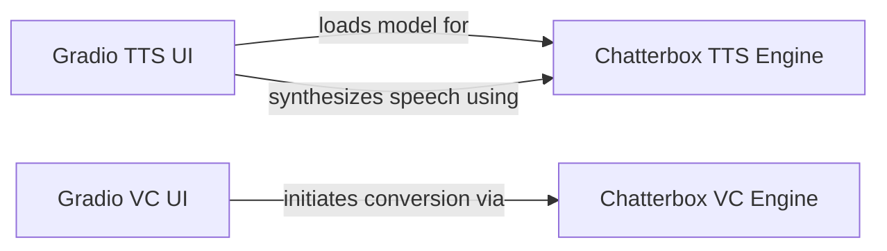

## Component Details

This subsystem provides web-based user interfaces for Text-to-Speech and Voice Conversion functionalities, allowing users to input text/audio and receive synthesized speech. It integrates Gradio UIs with the core Chatterbox TTS and VC engines to facilitate interactive speech generation and voice transformation.

### Gradio TTS UI
Provides the web-based user interface for Text-to-Speech functionality using Gradio. It orchestrates the interaction between UI elements and the core TTS model, handling model loading, text input, audio prompt input, and various generation parameters.

**Related Classes/Methods**:

- `chatterbox.gradio_tts_app` (full file reference)
- <a href="https://github.com/resemble-ai/chatterbox/blob/master/gradio_tts_app.py#L19-L21" target="_blank" rel="noopener noreferrer">`chatterbox.gradio_tts_app:load_model` (19:21)</a>
- <a href="https://github.com/resemble-ai/chatterbox/blob/master/gradio_tts_app.py#L24-L38" target="_blank" rel="noopener noreferrer">`chatterbox.gradio_tts_app:generate` (24:38)</a>
- <a href="https://github.com/resemble-ai/chatterbox/blob/master/gradio_tts_app.py#L11-L16" target="_blank" rel="noopener noreferrer">`chatterbox.gradio_tts_app:set_seed` (11:16)</a>

### Chatterbox TTS Engine
Encapsulates the core Text-to-Speech model logic. It is responsible for loading pre-trained TTS models and synthesizing speech waveforms based on provided text and configuration parameters.

**Related Classes/Methods**:

- <a href="https://github.com/resemble-ai/chatterbox/blob/master/src/chatterbox/tts.py#L106-L266" target="_blank" rel="noopener noreferrer">`chatterbox.tts.ChatterboxTTS` (106:266)</a>
- <a href="https://github.com/resemble-ai/chatterbox/blob/master/src/chatterbox/tts.py#L168-L180" target="_blank" rel="noopener noreferrer">`chatterbox.tts.ChatterboxTTS.from_pretrained` (168:180)</a>
- <a href="https://github.com/resemble-ai/chatterbox/blob/master/src/chatterbox/tts.py#L208-L266" target="_blank" rel="noopener noreferrer">`chatterbox.tts.ChatterboxTTS.generate` (208:266)</a>

### Gradio VC UI
Provides the web-based user interface for Voice Conversion functionality using Gradio. It manages the input and output for voice conversion tasks and initiates the conversion process through the core VC engine.

**Related Classes/Methods**:

- `chatterbox.gradio_vc_app` (full file reference)
- <a href="https://github.com/resemble-ai/chatterbox/blob/master/gradio_vc_app.py#L10-L14" target="_blank" rel="noopener noreferrer">`chatterbox.gradio_vc_app:generate` (10:14)</a>

### Chatterbox VC Engine
Contains the core logic for Voice Conversion. It provides the functionality to transform an input voice based on specific parameters or target characteristics.

**Related Classes/Methods**:

- <a href="https://github.com/resemble-ai/chatterbox/blob/master/src/chatterbox/vc.py#L16-L104" target="_blank" rel="noopener noreferrer">`chatterbox.vc.ChatterboxVC` (16:104)</a>
- <a href="https://github.com/resemble-ai/chatterbox/blob/master/src/chatterbox/vc.py#L83-L104" target="_blank" rel="noopener noreferrer">`chatterbox.vc.ChatterboxVC.generate` (83:104)</a>

### [FAQ](https://github.com/CodeBoarding/GeneratedOnBoardings/tree/main?tab=readme-ov-file#faq)