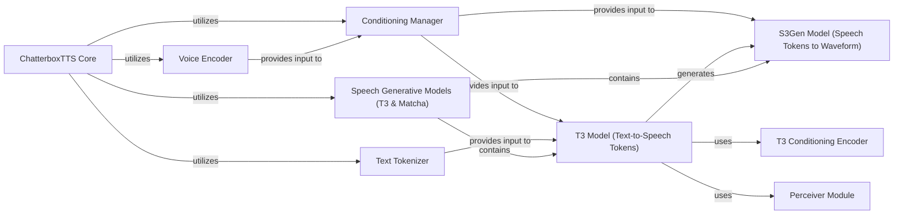

## Component Details

This architecture overview describes the core components involved in the Chatterbox Text-to-Speech (TTS) system, focusing on the generative models (T3 and Matcha) and their supporting modules. The main flow begins with the `ChatterboxTTS Core` orchestrating the process. It utilizes a `Text Tokenizer` to convert input text into tokens and a `Voice Encoder` to extract speaker embeddings from reference audio. These, along with other parameters, are managed by the `Conditioning Manager`. The `T3 Model` then takes these conditioned text tokens and generates speech tokens. Finally, the `S3Gen Model` synthesizes raw audio waveforms from these speech tokens, leveraging various transformer and decoder sub-modules to produce high-quality speech.

### Speech Generative Models (T3 & Matcha)
This overarching component encapsulates the core generative models, T3 and Matcha, which are responsible for transforming text or latent representations into speech tokens or mel spectrograms, leveraging transformer architectures for high-quality speech synthesis.

**Related Classes/Methods**:

- <a href="https://github.com/resemble-ai/chatterbox/blob/master/src/chatterbox/models/t3/t3.py#L37-L381" target="_blank" rel="noopener noreferrer">`chatterbox.src.chatterbox.models.t3.t3.T3` (37:381)</a>
- <a href="https://github.com/resemble-ai/chatterbox/blob/master/src/chatterbox/models/s3gen/matcha/flow_matching.py#L9-L115" target="_blank" rel="noopener noreferrer">`chatterbox.src.chatterbox.models.s3gen.matcha.flow_matching.BASECFM` (9:115)</a>
- <a href="https://github.com/resemble-ai/chatterbox/blob/master/src/chatterbox/models/s3gen/matcha/transformer.py#L138-L316" target="_blank" rel="noopener noreferrer">`chatterbox.src.chatterbox.models.s3gen.matcha.transformer.BasicTransformerBlock` (138:316)</a>
- <a href="https://github.com/resemble-ai/chatterbox/blob/master/src/chatterbox/models/s3gen/matcha/decoder.py#L200-L443" target="_blank" rel="noopener noreferrer">`chatterbox.src.chatterbox.models.s3gen.matcha.decoder.Decoder` (200:443)</a>
- <a href="https://github.com/resemble-ai/chatterbox/blob/master/src/chatterbox/models/s3gen/matcha/text_encoder.py#L331-L413" target="_blank" rel="noopener noreferrer">`chatterbox.src.chatterbox.models.s3gen.matcha.text_encoder.TextEncoder` (331:413)</a>
- `chatterbox.src.chatterbox.models.s3gen.transformer` (full file reference)

### ChatterboxTTS Core
The central component of the Chatterbox TTS system, responsible for orchestrating the entire text-to-speech generation process. It loads and manages various sub-models (T3, S3Gen, VoiceEncoder, Tokenizer), prepares conditioning data, and generates the final audio waveform from input text.

**Related Classes/Methods**:

- <a href="https://github.com/resemble-ai/chatterbox/blob/master/src/chatterbox/tts.py#L106-L266" target="_blank" rel="noopener noreferrer">`chatterbox.src.chatterbox.tts.ChatterboxTTS` (106:266)</a>
- <a href="https://github.com/resemble-ai/chatterbox/blob/master/src/chatterbox/tts.py#L129-L165" target="_blank" rel="noopener noreferrer">`chatterbox.src.chatterbox.tts.ChatterboxTTS:from_local` (129:165)</a>
- <a href="https://github.com/resemble-ai/chatterbox/blob/master/src/chatterbox/tts.py#L182-L206" target="_blank" rel="noopener noreferrer">`chatterbox.src.chatterbox.tts.ChatterboxTTS:prepare_conditionals` (182:206)</a>
- <a href="https://github.com/resemble-ai/chatterbox/blob/master/src/chatterbox/tts.py#L208-L266" target="_blank" rel="noopener noreferrer">`chatterbox.src.chatterbox.tts.ChatterboxTTS:generate` (208:266)</a>
- <a href="https://github.com/resemble-ai/chatterbox/blob/master/src/chatterbox/tts.py#L22-L61" target="_blank" rel="noopener noreferrer">`chatterbox.src.chatterbox.tts.punc_norm` (22:61)</a>

### Conditioning Manager
Manages and prepares the various conditioning inputs required by the T3 and S3Gen models. This includes speaker embeddings, speech prompt tokens, and emotion exaggeration, ensuring they are correctly formatted and moved to the appropriate device.

**Related Classes/Methods**:

- <a href="https://github.com/resemble-ai/chatterbox/blob/master/src/chatterbox/tts.py#L65-L103" target="_blank" rel="noopener noreferrer">`chatterbox.src.chatterbox.tts.Conditionals` (65:103)</a>
- <a href="https://github.com/resemble-ai/chatterbox/blob/master/src/chatterbox/tts.py#L84-L89" target="_blank" rel="noopener noreferrer">`chatterbox.src.chatterbox.tts.Conditionals:to` (84:89)</a>
- <a href="https://github.com/resemble-ai/chatterbox/blob/master/src/chatterbox/tts.py#L99-L103" target="_blank" rel="noopener noreferrer">`chatterbox.src.chatterbox.tts.Conditionals:load` (99:103)</a>

### T3 Model (Text-to-Speech Tokens)
The Token-To-Token (T3) model is a core component responsible for transforming text tokens into speech tokens. It utilizes a LlamaModel backbone and incorporates conditioning information to generate contextually relevant speech token sequences.

**Related Classes/Methods**:

- <a href="https://github.com/resemble-ai/chatterbox/blob/master/src/chatterbox/models/t3/t3.py#L37-L381" target="_blank" rel="noopener noreferrer">`chatterbox.src.chatterbox.models.t3.t3.T3` (37:381)</a>
- <a href="https://github.com/resemble-ai/chatterbox/blob/master/src/chatterbox/models/t3/t3.py#L86-L114" target="_blank" rel="noopener noreferrer">`chatterbox.src.chatterbox.models.t3.t3.T3:prepare_input_embeds` (86:114)</a>
- <a href="https://github.com/resemble-ai/chatterbox/blob/master/src/chatterbox/models/t3/t3.py#L116-L171" target="_blank" rel="noopener noreferrer">`chatterbox.src.chatterbox.models.t3.t3.T3:forward` (116:171)</a>
- <a href="https://github.com/resemble-ai/chatterbox/blob/master/src/chatterbox/models/t3/t3.py#L173-L207" target="_blank" rel="noopener noreferrer">`chatterbox.src.chatterbox.models.t3.t3.T3:loss` (173:207)</a>
- <a href="https://github.com/resemble-ai/chatterbox/blob/master/src/chatterbox/models/t3/t3.py#L210-L381" target="_blank" rel="noopener noreferrer">`chatterbox.src.chatterbox.models.t3.t3.T3:inference` (210:381)</a>
- <a href="https://github.com/resemble-ai/chatterbox/blob/master/src/chatterbox/models/t3/t3.py#L31-L34" target="_blank" rel="noopener noreferrer">`chatterbox.src.chatterbox.models.t3.t3._ensure_BOT_EOT` (31:34)</a>
- <a href="https://github.com/resemble-ai/chatterbox/blob/master/src/chatterbox/models/t3/t3.py#L25-L28" target="_blank" rel="noopener noreferrer">`chatterbox.src.chatterbox.models.t3.t3.AttrDict` (25:28)</a>
- <a href="https://github.com/resemble-ai/chatterbox/blob/master/src/chatterbox/models/t3/inference/t3_hf_backend.py#L9-L116" target="_blank" rel="noopener noreferrer">`chatterbox.src.chatterbox.models.t3.inference.t3_hf_backend.T3HuggingfaceBackend` (9:116)</a>

### T3 Conditioning Encoder
A module within the T3 model that specifically handles the encoding of various conditioning inputs, such as speaker embeddings and speech prompt tokens, into a format usable by the T3 transformer.

**Related Classes/Methods**:

- <a href="https://github.com/resemble-ai/chatterbox/blob/master/src/chatterbox/models/t3/modules/cond_enc.py#L12-L38" target="_blank" rel="noopener noreferrer">`chatterbox.src.chatterbox.models.t3.modules.cond_enc.T3Cond` (12:38)</a>
- <a href="https://github.com/resemble-ai/chatterbox/blob/master/src/chatterbox/models/t3/modules/cond_enc.py#L36-L38" target="_blank" rel="noopener noreferrer">`chatterbox.src.chatterbox.models.t3.modules.cond_enc.T3Cond:load` (36:38)</a>

### S3Gen Model (Speech Tokens to Waveform)
This component is responsible for synthesizing raw audio waveforms from the speech tokens generated by the T3 model. It likely incorporates various sub-modules for attention, decoding, and text encoding to produce high-quality audio.

**Related Classes/Methods**:

- <a href="https://github.com/resemble-ai/chatterbox/blob/master/src/chatterbox/models/s3gen/s3gen.py#L219-L305" target="_blank" rel="noopener noreferrer">`chatterbox.src.chatterbox.models.s3gen.s3gen.S3Token2Wav` (219:305)</a>
- <a href="https://github.com/resemble-ai/chatterbox/blob/master/src/chatterbox/models/s3gen/matcha/flow_matching.py#L30-L50" target="_blank" rel="noopener noreferrer">`chatterbox.src.chatterbox.models.s3gen.matcha.flow_matching.BASECFM:forward` (30:50)</a>
- <a href="https://github.com/resemble-ai/chatterbox/blob/master/src/chatterbox/models/s3gen/matcha/flow_matching.py#L119-L129" target="_blank" rel="noopener noreferrer">`chatterbox.src.chatterbox.models.s3gen.matcha.flow_matching.CFM:__init__` (119:129)</a>
- <a href="https://github.com/resemble-ai/chatterbox/blob/master/src/chatterbox/models/s3gen/matcha/transformer.py#L96-L129" target="_blank" rel="noopener noreferrer">`chatterbox.src.chatterbox.models.s3gen.matcha.transformer.FeedForward:__init__` (96:129)</a>
- <a href="https://github.com/resemble-ai/chatterbox/blob/master/src/chatterbox/models/s3gen/matcha/transformer.py#L159-L236" target="_blank" rel="noopener noreferrer">`chatterbox.src.chatterbox.models.s3gen.matcha.transformer.BasicTransformerBlock:__init__` (159:236)</a>
- <a href="https://github.com/resemble-ai/chatterbox/blob/master/src/chatterbox/models/s3gen/matcha/transformer.py#L243-L316" target="_blank" rel="noopener noreferrer">`chatterbox.src.chatterbox.models.s3gen.matcha.transformer.BasicTransformerBlock:forward` (243:316)</a>
- <a href="https://github.com/resemble-ai/chatterbox/blob/master/src/chatterbox/models/s3gen/matcha/decoder.py#L47-L54" target="_blank" rel="noopener noreferrer">`chatterbox.src.chatterbox.models.s3gen.matcha.decoder.ResnetBlock1D:__init__` (47:54)</a>
- <a href="https://github.com/resemble-ai/chatterbox/blob/master/src/chatterbox/models/s3gen/matcha/decoder.py#L56-L61" target="_blank" rel="noopener noreferrer">`chatterbox.src.chatterbox.models.s3gen.matcha.decoder.ResnetBlock1D:forward` (56:61)</a>
- <a href="https://github.com/resemble-ai/chatterbox/blob/master/src/chatterbox/models/s3gen/matcha/decoder.py#L201-L315" target="_blank" rel="noopener noreferrer">`chatterbox.src.chatterbox.models.s3gen.matcha.decoder.Decoder:__init__` (201:315)</a>
- <a href="https://github.com/resemble-ai/chatterbox/blob/master/src/chatterbox/models/s3gen/matcha/decoder.py#L319-L343" target="_blank" rel="noopener noreferrer">`chatterbox.src.chatterbox.models.s3gen.matcha.decoder.Decoder:get_block` (319:343)</a>
- <a href="https://github.com/resemble-ai/chatterbox/blob/master/src/chatterbox/models/s3gen/matcha/decoder.py#L363-L443" target="_blank" rel="noopener noreferrer">`chatterbox.src.chatterbox.models.s3gen.matcha.decoder.Decoder:forward` (363:443)</a>
- <a href="https://github.com/resemble-ai/chatterbox/blob/master/src/chatterbox/models/s3gen/matcha/text_encoder.py#L40-L61" target="_blank" rel="noopener noreferrer">`chatterbox.src.chatterbox.models.s3gen.matcha.text_encoder.ConvReluNorm:__init__` (40:61)</a>
- <a href="https://github.com/resemble-ai/chatterbox/blob/master/src/chatterbox/models/s3gen/matcha/text_encoder.py#L74-L85" target="_blank" rel="noopener noreferrer">`chatterbox.src.chatterbox.models.s3gen.matcha.text_encoder.DurationPredictor:__init__` (74:85)</a>
- <a href="https://github.com/resemble-ai/chatterbox/blob/master/src/chatterbox/models/s3gen/matcha/text_encoder.py#L87-L97" target="_blank" rel="noopener noreferrer">`chatterbox.src.chatterbox.models.s3gen.matcha.text_encoder.DurationPredictor:forward` (87:97)</a>
- <a href="https://github.com/resemble-ai/chatterbox/blob/master/src/chatterbox/models/s3gen/matcha/text_encoder.py#L157-L175" target="_blank" rel="noopener noreferrer">`chatterbox.src.chatterbox.models.s3gen.matcha.text_encoder.RotaryPositionalEmbeddings:forward` (157:175)</a>
- <a href="https://github.com/resemble-ai/chatterbox/blob/master/src/chatterbox/models/s3gen/matcha/text_encoder.py#L179-L217" target="_blank" rel="noopener noreferrer">`chatterbox.src.chatterbox.models.s3gen.matcha.text_encoder.MultiHeadAttention:__init__` (179:217)</a>
- <a href="https://github.com/resemble-ai/chatterbox/blob/master/src/chatterbox/models/s3gen/matcha/text_encoder.py#L219-L227" target="_blank" rel="noopener noreferrer">`chatterbox.src.chatterbox.models.s3gen.matcha.text_encoder.MultiHeadAttention:forward` (219:227)</a>
- <a href="https://github.com/resemble-ai/chatterbox/blob/master/src/chatterbox/models/s3gen/matcha/text_encoder.py#L229-L249" target="_blank" rel="noopener noreferrer">`chatterbox.src.chatterbox.models.s3gen.matcha.text_encoder.MultiHeadAttention:attention` (229:249)</a>
- <a href="https://github.com/resemble-ai/chatterbox/blob/master/src/chatterbox/models/s3gen/matcha/text_encoder.py#L280-L315" target="_blank" rel="noopener noreferrer">`chatterbox.src.chatterbox.models.s3gen.matcha.text_encoder.Encoder:__init__` (280:315)</a>
- <a href="https://github.com/resemble-ai/chatterbox/blob/master/src/chatterbox/models/s3gen/matcha/text_encoder.py#L332-L379" target="_blank" rel="noopener noreferrer">`chatterbox.src.chatterbox.models.s3gen.matcha.text_encoder.TextEncoder:__init__` (332:379)</a>
- <a href="https://github.com/resemble-ai/chatterbox/blob/master/src/chatterbox/models/s3gen/matcha/text_encoder.py#L381-L413" target="_blank" rel="noopener noreferrer">`chatterbox.src.chatterbox.models.s3gen.matcha.text_encoder.TextEncoder:forward` (381:413)</a>
- <a href="https://github.com/resemble-ai/chatterbox/blob/master/src/chatterbox/models/s3gen/transformer/subsampling.py#L39-L43" target="_blank" rel="noopener noreferrer">`chatterbox.src.chatterbox.models.s3gen.transformer.subsampling.EmbedinigNoSubsampling:__init__` (39:43)</a>
- <a href="https://github.com/resemble-ai/chatterbox/blob/master/src/chatterbox/models/s3gen/transformer/subsampling.py#L79-L90" target="_blank" rel="noopener noreferrer">`chatterbox.src.chatterbox.models.s3gen.transformer.subsampling.LinearNoSubsampling:__init__` (79:90)</a>
- <a href="https://github.com/resemble-ai/chatterbox/blob/master/src/chatterbox/models/s3gen/transformer/subsampling.py#L128-L143" target="_blank" rel="noopener noreferrer">`chatterbox.src.chatterbox.models.s3gen.transformer.subsampling.Conv1dSubsampling2:__init__` (128:143)</a>
- <a href="https://github.com/resemble-ai/chatterbox/blob/master/src/chatterbox/models/s3gen/transformer/subsampling.py#L183-L200" target="_blank" rel="noopener noreferrer">`chatterbox.src.chatterbox.models.s3gen.transformer.subsampling.Conv2dSubsampling4:__init__` (183:200)</a>
- <a href="https://github.com/resemble-ai/chatterbox/blob/master/src/chatterbox/models/s3gen/transformer/subsampling.py#L239-L254" target="_blank" rel="noopener noreferrer">`chatterbox.src.chatterbox.models.s3gen.transformer.subsampling.Conv2dSubsampling6:__init__` (239:254)</a>
- <a href="https://github.com/resemble-ai/chatterbox/blob/master/src/chatterbox/models/s3gen/transformer/subsampling.py#L292-L309" target="_blank" rel="noopener noreferrer">`chatterbox.src.chatterbox.models.s3gen.transformer.subsampling.Conv2dSubsampling8:__init__` (292:309)</a>
- <a href="https://github.com/resemble-ai/chatterbox/blob/master/src/chatterbox/models/s3gen/transformer/subsampling.py#L348-L360" target="_blank" rel="noopener noreferrer">`chatterbox.src.chatterbox.models.s3gen.transformer.subsampling.LegacyLinearNoSubsampling:__init__` (348:360)</a>
- <a href="https://github.com/resemble-ai/chatterbox/blob/master/src/chatterbox/models/s3gen/transformer/attention.py#L129-L197" target="_blank" rel="noopener noreferrer">`chatterbox.src.chatterbox.models.s3gen.transformer.attention.MultiHeadedAttention:forward` (129:197)</a>
- <a href="https://github.com/resemble-ai/chatterbox/blob/master/src/chatterbox/models/s3gen/transformer/attention.py#L209-L223" target="_blank" rel="noopener noreferrer">`chatterbox.src.chatterbox.models.s3gen.transformer.attention.RelPositionMultiHeadedAttention:__init__` (209:223)</a>
- <a href="https://github.com/resemble-ai/chatterbox/blob/master/src/chatterbox/models/s3gen/transformer/attention.py#L249-L330" target="_blank" rel="noopener noreferrer">`chatterbox.src.chatterbox.models.s3gen.transformer.attention.RelPositionMultiHeadedAttention:forward` (249:330)</a>
- <a href="https://github.com/resemble-ai/chatterbox/blob/master/src/chatterbox/models/s3gen/transformer/upsample_encoder.py#L101-L232" target="_blank" rel="noopener noreferrer">`chatterbox.src.chatterbox.models.s3gen.transformer.upsample_encoder.UpsampleConformerEncoder:__init__` (101:232)</a>
- <a href="https://github.com/resemble-ai/chatterbox/blob/master/src/chatterbox/models/s3gen/transformer/upsample_encoder.py#L237-L304" target="_blank" rel="noopener noreferrer">`chatterbox.src.chatterbox.models.s3gen.transformer.upsample_encoder.UpsampleConformerEncoder:forward` (237:304)</a>
- <a href="https://github.com/resemble-ai/chatterbox/blob/master/src/chatterbox/models/s3gen/transformer/embedding.py#L59-L77" target="_blank" rel="noopener noreferrer">`chatterbox.src.chatterbox.models.s3gen.transformer.embedding.PositionalEncoding:forward` (59:77)</a>
- <a href="https://github.com/resemble-ai/chatterbox/blob/master/src/chatterbox/models/s3gen/transformer/embedding.py#L129-L131" target="_blank" rel="noopener noreferrer">`chatterbox.src.chatterbox.models.s3gen.transformer.embedding.RelPositionalEncoding:__init__` (129:131)</a>
- <a href="https://github.com/resemble-ai/chatterbox/blob/master/src/chatterbox/models/s3gen/transformer/embedding.py#L133-L147" target="_blank" rel="noopener noreferrer">`chatterbox.src.chatterbox.models.s3gen.transformer.embedding.RelPositionalEncoding:forward` (133:147)</a>
- <a href="https://github.com/resemble-ai/chatterbox/blob/master/src/chatterbox/models/s3gen/transformer/embedding.py#L154-L164" target="_blank" rel="noopener noreferrer">`chatterbox.src.chatterbox.models.s3gen.transformer.embedding.WhisperPositionalEncoding:__init__` (154:164)</a>
- <a href="https://github.com/resemble-ai/chatterbox/blob/master/src/chatterbox/models/s3gen/transformer/embedding.py#L171-L175" target="_blank" rel="noopener noreferrer">`chatterbox.src.chatterbox.models.s3gen.transformer.embedding.LearnablePositionalEncoding:__init__` (171:175)</a>
- <a href="https://github.com/resemble-ai/chatterbox/blob/master/src/chatterbox/models/s3gen/transformer/embedding.py#L215-L222" target="_blank" rel="noopener noreferrer">`chatterbox.src.chatterbox.models.s3gen.transformer.embedding.EspnetRelPositionalEncoding:__init__` (215:222)</a>
- <a href="https://github.com/resemble-ai/chatterbox/blob/master/src/chatterbox/models/s3gen/transformer/embedding.py#L256-L270" target="_blank" rel="noopener noreferrer">`chatterbox.src.chatterbox.models.s3gen.transformer.embedding.EspnetRelPositionalEncoding:forward` (256:270)</a>
- <a href="https://github.com/resemble-ai/chatterbox/blob/master/src/chatterbox/models/s3gen/transformer/positionwise_feed_forward.py#L75-L89" target="_blank" rel="noopener noreferrer">`chatterbox.src.chatterbox.models.s3gen.transformer.positionwise_feed_forward.MoEFFNLayer:__init__` (75:89)</a>

### Text Tokenizer
This component is responsible for converting raw input text into a sequence of numerical tokens that can be processed by the T3 model. It handles the linguistic processing required for text-to-speech.

**Related Classes/Methods**:

- <a href="https://github.com/resemble-ai/chatterbox/blob/master/src/chatterbox/models/tokenizers/tokenizer.py#L16-L50" target="_blank" rel="noopener noreferrer">`chatterbox.src.chatterbox.models.tokenizers.tokenizer.EnTokenizer` (16:50)</a>

### Voice Encoder
The Voice Encoder extracts speaker embeddings from reference audio inputs. These embeddings capture the unique characteristics of a speaker's voice and are used as conditioning information for the T3 model to synthesize speech in a similar voice.

**Related Classes/Methods**:

- <a href="https://github.com/resemble-ai/chatterbox/blob/master/src/chatterbox/models/voice_encoder/voice_encoder.py#L119-L274" target="_blank" rel="noopener noreferrer">`chatterbox.src.chatterbox.models.voice_encoder.voice_encoder.VoiceEncoder` (119:274)</a>

### Perceiver Module
A sub-module within the T3 model, likely responsible for processing and integrating various input modalities (e.g., text, conditioning) through attention mechanisms to generate a unified representation for speech token generation.

**Related Classes/Methods**:

- <a href="https://github.com/resemble-ai/chatterbox/blob/master/src/chatterbox/models/t3/modules/perceiver.py#L43-L52" target="_blank" rel="noopener noreferrer">`chatterbox.src.chatterbox.models.t3.modules.perceiver.RelativePositionBias:forward` (43:52)</a>
- <a href="https://github.com/resemble-ai/chatterbox/blob/master/src/chatterbox/models/t3/modules/perceiver.py#L56-L64" target="_blank" rel="noopener noreferrer">`chatterbox.src.chatterbox.models.t3.modules.perceiver.AttentionQKV:__init__` (56:64)</a>
- <a href="https://github.com/resemble-ai/chatterbox/blob/master/src/chatterbox/models/t3/modules/perceiver.py#L75-L82" target="_blank" rel="noopener noreferrer">`chatterbox.src.chatterbox.models.t3.modules.perceiver.AttentionQKV:forward` (75:82)</a>
- <a href="https://github.com/resemble-ai/chatterbox/blob/master/src/chatterbox/models/t3/modules/perceiver.py#L119-L154" target="_blank" rel="noopener noreferrer">`chatterbox.src.chatterbox.models.t3.modules.perceiver.AttentionBlock2:__init__` (119:154)</a>
- <a href="https://github.com/resemble-ai/chatterbox/blob/master/src/chatterbox/models/t3/modules/perceiver.py#L156-L170" target="_blank" rel="noopener noreferrer">`chatterbox.src.chatterbox.models.t3.modules.perceiver.AttentionBlock2:forward` (156:170)</a>
- <a href="https://github.com/resemble-ai/chatterbox/blob/master/src/chatterbox/models/t3/modules/perceiver.py#L175-L198" target="_blank" rel="noopener noreferrer">`chatterbox.src.chatterbox.models.t3.modules.perceiver.Perceiver:__init__` (175:198)</a>
- <a href="https://github.com/resemble-ai/chatterbox/blob/master/src/chatterbox/models/t3/modules/perceiver.py#L200-L212" target="_blank" rel="noopener noreferrer">`chatterbox.src.chatterbox.models.t3.modules.perceiver.Perceiver:forward` (200:212)</a>

### [FAQ](https://github.com/CodeBoarding/GeneratedOnBoardings/tree/main?tab=readme-ov-file#faq)