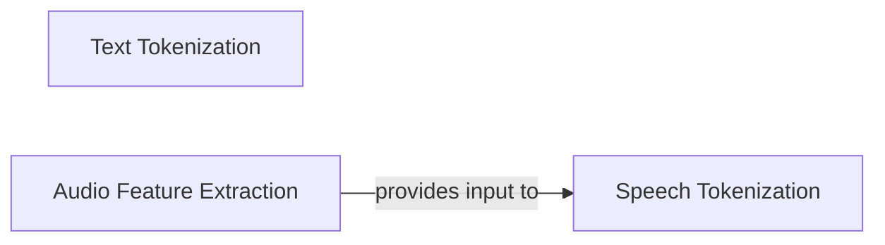

## Component Details

The Text & Audio Preprocessing subsystem is responsible for transforming raw input data into formats suitable for machine learning models within the Chatterbox TTS system. This involves converting raw text into discrete tokens, normalizing punctuation, and processing raw audio signals into numerical features like mel spectrograms, which are then further converted into speech tokens. This comprehensive preprocessing ensures that both textual and auditory inputs are consistently prepared for subsequent stages of the text-to-speech pipeline.

### Text Tokenization
Handles the conversion of raw input text into a sequence of discrete tokens, including the crucial step of punctuation normalization to ensure linguistic consistency and proper formatting for downstream models.

**Related Classes/Methods**:

- <a href="https://github.com/resemble-ai/chatterbox/blob/master/src/chatterbox/models/tokenizers/tokenizer.py#L16-L50" target="_blank" rel="noopener noreferrer">`chatterbox.src.chatterbox.models.tokenizers.tokenizer.EnTokenizer` (16:50)</a>
- <a href="https://github.com/resemble-ai/chatterbox/blob/master/src/chatterbox/tts.py#L22-L61" target="_blank" rel="noopener noreferrer">`chatterbox.src.chatterbox.tts.punc_norm` (22:61)</a>

### Audio Feature Extraction
Extracts essential numerical features, specifically mel spectrograms, from raw audio waveforms. These features serve as a fundamental representation of audio content for machine learning models.

**Related Classes/Methods**:

- `chatterbox.src.chatterbox.models.s3gen.utils.mel` (full file reference)
- `chatterbox.src.chatterbox.models.voice_encoder.melspec` (full file reference)

### Speech Tokenization
Converts processed audio features (mel spectrograms) into a sequence of discrete speech tokens. These tokens are vital for conditioning and analysis within the speech synthesis models.

**Related Classes/Methods**:

- `chatterbox.src.chatterbox.models.s3tokenizer` (full file reference)
- <a href="https://github.com/resemble-ai/chatterbox/blob/master/src/chatterbox/models/s3tokenizer/s3tokenizer.py#L22-L168" target="_blank" rel="noopener noreferrer">`chatterbox.src.chatterbox.models.s3tokenizer.s3tokenizer.S3Tokenizer` (22:168)</a>

### [FAQ](https://github.com/CodeBoarding/GeneratedOnBoardings/tree/main?tab=readme-ov-file#faq)