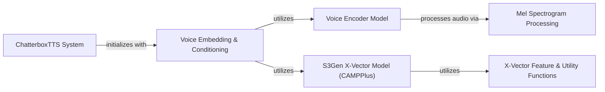

## Component Details

This graph illustrates the core components and their interactions within the Chatterbox TTS system, focusing on how voice characteristics are extracted and utilized. The main flow involves the ChatterboxTTS System initializing and leveraging the Voice Embedding & Conditioning component. This component, in turn, uses both the Voice Encoder Model and the S3Gen X-Vector Model (CAMPPlus) to process audio and generate speaker embeddings. The Voice Encoder Model relies on Mel Spectrogram Processing for audio feature transformation, while the S3Gen X-Vector Model is supported by various X-Vector Feature & Utility Functions for its operations. The overall purpose is to generate speech conditioned on unique speaker characteristics.

### ChatterboxTTS System
This is the overarching Text-to-Speech system that orchestrates the process of generating speech, potentially leveraging other components for voice characteristics.

**Related Classes/Methods**:

- <a href="https://github.com/resemble-ai/chatterbox/blob/master/src/chatterbox/tts.py#L106-L266" target="_blank" rel="noopener noreferrer">`chatterbox.src.chatterbox.tts.ChatterboxTTS` (106:266)</a>

### Voice Embedding & Conditioning
Extracts unique speaker characteristics from audio, generating embeddings that represent a speaker's voice for conditioning generative models. It leverages specialized models like VoiceEncoder and CAMPPlus for this purpose.

**Related Classes/Methods**:

- <a href="https://github.com/resemble-ai/chatterbox/blob/master/src/chatterbox/models/voice_encoder/voice_encoder.py#L119-L274" target="_blank" rel="noopener noreferrer">`chatterbox.src.chatterbox.models.voice_encoder.voice_encoder.VoiceEncoder` (119:274)</a>
- <a href="https://github.com/resemble-ai/chatterbox/blob/master/src/chatterbox/models/s3gen/xvector.py#L340-L428" target="_blank" rel="noopener noreferrer">`chatterbox.src.chatterbox.models.s3gen.xvector.CAMPPlus` (340:428)</a>

### Voice Encoder Model
A neural network model specifically designed to extract speaker embeddings from audio or mel spectrograms, enabling the representation of unique voice characteristics. It provides functionalities for inference and similarity calculations.

**Related Classes/Methods**:

- <a href="https://github.com/resemble-ai/chatterbox/blob/master/src/chatterbox/models/voice_encoder/voice_encoder.py#L119-L274" target="_blank" rel="noopener noreferrer">`chatterbox.src.chatterbox.models.voice_encoder.voice_encoder.VoiceEncoder` (119:274)</a>
- <a href="https://github.com/resemble-ai/chatterbox/blob/master/src/chatterbox/models/voice_encoder/voice_encoder.py#L16-L51" target="_blank" rel="noopener noreferrer">`chatterbox.src.chatterbox.models.voice_encoder.voice_encoder.pack` (16:51)</a>
- <a href="https://github.com/resemble-ai/chatterbox/blob/master/src/chatterbox/models/voice_encoder/voice_encoder.py#L54-L66" target="_blank" rel="noopener noreferrer">`chatterbox.src.chatterbox.models.voice_encoder.voice_encoder.get_num_wins` (54:66)</a>
- <a href="https://github.com/resemble-ai/chatterbox/blob/master/src/chatterbox/models/voice_encoder/voice_encoder.py#L69-L81" target="_blank" rel="noopener noreferrer">`chatterbox.src.chatterbox.models.voice_encoder.voice_encoder.get_frame_step` (69:81)</a>
- <a href="https://github.com/resemble-ai/chatterbox/blob/master/src/chatterbox/models/voice_encoder/voice_encoder.py#L84-L116" target="_blank" rel="noopener noreferrer">`chatterbox.src.chatterbox.models.voice_encoder.voice_encoder.stride_as_partials` (84:116)</a>

### Mel Spectrogram Processing
This utility component is responsible for the transformation of raw audio signals into mel spectrograms, a frequency-domain representation crucial for many speech processing and synthesis tasks.

**Related Classes/Methods**:

- <a href="https://github.com/resemble-ai/chatterbox/blob/master/src/chatterbox/models/voice_encoder/melspec.py#L26-L51" target="_blank" rel="noopener noreferrer">`chatterbox.src.chatterbox.models.voice_encoder.melspec.melspectrogram` (26:51)</a>
- <a href="https://github.com/resemble-ai/chatterbox/blob/master/src/chatterbox/models/voice_encoder/melspec.py#L19-L23" target="_blank" rel="noopener noreferrer">`chatterbox.src.chatterbox.models.voice_encoder.melspec.preemphasis` (19:23)</a>
- <a href="https://github.com/resemble-ai/chatterbox/blob/master/src/chatterbox/models/voice_encoder/melspec.py#L54-L64" target="_blank" rel="noopener noreferrer">`chatterbox.src.chatterbox.models.voice_encoder.melspec._stft` (54:64)</a>
- <a href="https://github.com/resemble-ai/chatterbox/blob/master/src/chatterbox/models/voice_encoder/melspec.py#L9-L16" target="_blank" rel="noopener noreferrer">`chatterbox.src.chatterbox.models.voice_encoder.melspec.mel_basis` (9:16)</a>
- <a href="https://github.com/resemble-ai/chatterbox/blob/master/src/chatterbox/models/voice_encoder/melspec.py#L67-L68" target="_blank" rel="noopener noreferrer">`chatterbox.src.chatterbox.models.voice_encoder.melspec._amp_to_db` (67:68)</a>
- <a href="https://github.com/resemble-ai/chatterbox/blob/master/src/chatterbox/models/voice_encoder/melspec.py#L75-L78" target="_blank" rel="noopener noreferrer">`chatterbox.src.chatterbox.models.voice_encoder.melspec._normalize` (75:78)</a>

### S3Gen X-Vector Model (CAMPPlus)
This component implements a sophisticated speaker verification model, CAMPPlus, which processes audio features through a series of TDNN and attention-based layers to produce speaker embeddings.

**Related Classes/Methods**:

- <a href="https://github.com/resemble-ai/chatterbox/blob/master/src/chatterbox/models/s3gen/xvector.py#L340-L428" target="_blank" rel="noopener noreferrer">`chatterbox.src.chatterbox.models.s3gen.xvector.CAMPPlus` (340:428)</a>
- <a href="https://github.com/resemble-ai/chatterbox/blob/master/src/chatterbox/models/s3gen/xvector.py#L94-L127" target="_blank" rel="noopener noreferrer">`chatterbox.src.chatterbox.models.s3gen.xvector.FCM` (94:127)</a>
- <a href="https://github.com/resemble-ai/chatterbox/blob/master/src/chatterbox/models/s3gen/xvector.py#L160-L192" target="_blank" rel="noopener noreferrer">`chatterbox.src.chatterbox.models.s3gen.xvector.TDNNLayer` (160:192)</a>
- <a href="https://github.com/resemble-ai/chatterbox/blob/master/src/chatterbox/models/s3gen/xvector.py#L195-L231" target="_blank" rel="noopener noreferrer">`chatterbox.src.chatterbox.models.s3gen.xvector.CAMLayer` (195:231)</a>
- <a href="https://github.com/resemble-ai/chatterbox/blob/master/src/chatterbox/models/s3gen/xvector.py#L234-L275" target="_blank" rel="noopener noreferrer">`chatterbox.src.chatterbox.models.s3gen.xvector.CAMDenseTDNNLayer` (234:275)</a>
- <a href="https://github.com/resemble-ai/chatterbox/blob/master/src/chatterbox/models/s3gen/xvector.py#L278-L310" target="_blank" rel="noopener noreferrer">`chatterbox.src.chatterbox.models.s3gen.xvector.CAMDenseTDNNBlock` (278:310)</a>
- <a href="https://github.com/resemble-ai/chatterbox/blob/master/src/chatterbox/models/s3gen/xvector.py#L313-L322" target="_blank" rel="noopener noreferrer">`chatterbox.src.chatterbox.models.s3gen.xvector.TransitLayer` (313:322)</a>
- <a href="https://github.com/resemble-ai/chatterbox/blob/master/src/chatterbox/models/s3gen/xvector.py#L325-L337" target="_blank" rel="noopener noreferrer">`chatterbox.src.chatterbox.models.s3gen.xvector.DenseLayer` (325:337)</a>
- <a href="https://github.com/resemble-ai/chatterbox/blob/master/src/chatterbox/models/s3gen/xvector.py#L155-L157" target="_blank" rel="noopener noreferrer">`chatterbox.src.chatterbox.models.s3gen.xvector.StatsPool` (155:157)</a>
- <a href="https://github.com/resemble-ai/chatterbox/blob/master/src/chatterbox/models/s3gen/xvector.py#L61-L91" target="_blank" rel="noopener noreferrer">`chatterbox.src.chatterbox.models.s3gen.xvector.BasicResBlock` (61:91)</a>

### X-Vector Feature & Utility Functions
This component encompasses various utility functions crucial for the S3Gen X-Vector Model, including initial feature extraction from raw audio, padding operations, and the generation of non-linear activation layers.

**Related Classes/Methods**:

- <a href="https://github.com/resemble-ai/chatterbox/blob/master/src/chatterbox/models/s3gen/xvector.py#L45-L58" target="_blank" rel="noopener noreferrer">`chatterbox.src.chatterbox.models.s3gen.xvector.extract_feature` (45:58)</a>
- <a href="https://github.com/resemble-ai/chatterbox/blob/master/src/chatterbox/models/s3gen/xvector.py#L15-L42" target="_blank" rel="noopener noreferrer">`chatterbox.src.chatterbox.models.s3gen.xvector.pad_list` (15:42)</a>
- <a href="https://github.com/resemble-ai/chatterbox/blob/master/src/chatterbox/models/s3gen/xvector.py#L130-L143" target="_blank" rel="noopener noreferrer">`chatterbox.src.chatterbox.models.s3gen.xvector.get_nonlinear` (130:143)</a>
- <a href="https://github.com/resemble-ai/chatterbox/blob/master/src/chatterbox/models/s3gen/xvector.py#L146-L152" target="_blank" rel="noopener noreferrer">`chatterbox.src.chatterbox.models.s3gen.xvector.statistics_pooling` (146:152)</a>

### [FAQ](https://github.com/CodeBoarding/GeneratedOnBoardings/tree/main?tab=readme-ov-file#faq)