```mermaid
graph LR
    Gradio_User_Interfaces["Gradio User Interfaces"]
    Chatterbox_Core_Systems["Chatterbox Core Systems"]
    Text_Audio_Preprocessing["Text & Audio Preprocessing"]
    Voice_Embedding_Conditioning["Voice Embedding & Conditioning"]
    Speech_Generative_Models_T3_Matcha_["Speech Generative Models (T3 & Matcha)"]
    Audio_Synthesis_Vocoding_S3Gen_HiFi_GAN_["Audio Synthesis & Vocoding (S3Gen & HiFi-GAN)"]
    Gradio_User_Interfaces -- "initiates" --> Chatterbox_Core_Systems
    Chatterbox_Core_Systems -- "processes text/audio with" --> Text_Audio_Preprocessing
    Chatterbox_Core_Systems -- "conditions with" --> Voice_Embedding_Conditioning
    Chatterbox_Core_Systems -- "utilizes" --> Speech_Generative_Models_T3_Matcha_
    Chatterbox_Core_Systems -- "synthesizes audio with" --> Audio_Synthesis_Vocoding_S3Gen_HiFi_GAN_
    Text_Audio_Preprocessing -- "provides input to" --> Speech_Generative_Models_T3_Matcha_
    Text_Audio_Preprocessing -- "provides input to" --> Voice_Embedding_Conditioning
    Voice_Embedding_Conditioning -- "provides conditioning to" --> Speech_Generative_Models_T3_Matcha_
    Voice_Embedding_Conditioning -- "provides conditioning to" --> Audio_Synthesis_Vocoding_S3Gen_HiFi_GAN_
    Speech_Generative_Models_T3_Matcha_ -- "outputs speech tokens/features to" --> Audio_Synthesis_Vocoding_S3Gen_HiFi_GAN_
    click Gradio_User_Interfaces href "https://github.com/CodeBoarding/GeneratedOnBoardings/blob/main/chatterbox/Gradio User Interfaces.md" "Details"
    click Chatterbox_Core_Systems href "https://github.com/CodeBoarding/GeneratedOnBoardings/blob/main/chatterbox/Chatterbox Core Systems.md" "Details"
    click Text_Audio_Preprocessing href "https://github.com/CodeBoarding/GeneratedOnBoardings/blob/main/chatterbox/Text & Audio Preprocessing.md" "Details"
    click Voice_Embedding_Conditioning href "https://github.com/CodeBoarding/GeneratedOnBoardings/blob/main/chatterbox/Voice Embedding & Conditioning.md" "Details"
    click Speech_Generative_Models_T3_Matcha_ href "https://github.com/CodeBoarding/GeneratedOnBoardings/blob/main/chatterbox/Speech Generative Models (T3 & Matcha).md" "Details"
    click Audio_Synthesis_Vocoding_S3Gen_HiFi_GAN_ href "https://github.com/CodeBoarding/GeneratedOnBoardings/blob/main/chatterbox/Audio Synthesis & Vocoding (S3Gen & HiFi-GAN).md" "Details"
```

## Component Details

The Chatterbox project provides a comprehensive system for Text-to-Speech (TTS) and Voice Conversion (VC) functionalities, accessible via Gradio web interfaces. The core flow involves user input through the Gradio interfaces, which then triggers the Chatterbox Core Systems to orchestrate the speech generation or conversion process. This orchestration includes text and audio preprocessing, voice embedding for conditioning, utilization of advanced generative models (T3 and Matcha) for speech token/feature generation, and a final audio synthesis and vocoding stage to produce high-fidelity audio output.

### Gradio User Interfaces
Provides web-based user interfaces for Text-to-Speech and Voice Conversion functionalities, allowing users to input text/audio and receive synthesized speech.

**Related Classes/Methods**:

- `chatterbox.gradio_tts_app` (full file reference)
- `chatterbox.gradio_vc_app` (full file reference)

### Chatterbox Core Systems
The central orchestration layer for both Text-to-Speech and Voice Conversion processes, managing the flow between different model components and handling model loading and conditioning.

**Related Classes/Methods**:

- <a href="https://github.com/resemble-ai/chatterbox/blob/master/src/chatterbox/tts.py#L106-L266" target="_blank" rel="noopener noreferrer">`chatterbox.src.chatterbox.tts.ChatterboxTTS` (106:266)</a>
- <a href="https://github.com/resemble-ai/chatterbox/blob/master/src/chatterbox/tts.py#L65-L103" target="_blank" rel="noopener noreferrer">`chatterbox.src.chatterbox.tts.Conditionals` (65:103)</a>
- <a href="https://github.com/resemble-ai/chatterbox/blob/master/src/chatterbox/vc.py#L16-L104" target="_blank" rel="noopener noreferrer">`chatterbox.src.chatterbox.vc.ChatterboxVC` (16:104)</a>

### Text & Audio Preprocessing
Handles the conversion of raw text into tokens and raw audio signals into numerical features (mel spectrograms) suitable for machine learning models.

**Related Classes/Methods**:

- <a href="https://github.com/resemble-ai/chatterbox/blob/master/src/chatterbox/models/tokenizers/tokenizer.py#L16-L50" target="_blank" rel="noopener noreferrer">`chatterbox.src.chatterbox.models.tokenizers.tokenizer.EnTokenizer` (16:50)</a>
- <a href="https://github.com/resemble-ai/chatterbox/blob/master/src/chatterbox/tts.py#L22-L61" target="_blank" rel="noopener noreferrer">`chatterbox.src.chatterbox.tts.punc_norm` (22:61)</a>
- `chatterbox.src.chatterbox.models.s3tokenizer` (full file reference)
- <a href="https://github.com/resemble-ai/chatterbox/blob/master/src/chatterbox/models/s3tokenizer/s3tokenizer.py#L22-L168" target="_blank" rel="noopener noreferrer">`chatterbox.src.chatterbox.models.s3tokenizer.s3tokenizer.S3Tokenizer` (22:168)</a>
- `chatterbox.src.chatterbox.models.s3gen.utils.mel` (full file reference)
- `chatterbox.src.chatterbox.models.voice_encoder.melspec` (full file reference)

### Voice Embedding & Conditioning
Extracts unique speaker characteristics from audio, generating embeddings that represent a speaker's voice for conditioning generative models.

**Related Classes/Methods**:

- <a href="https://github.com/resemble-ai/chatterbox/blob/master/src/chatterbox/models/voice_encoder/voice_encoder.py#L119-L274" target="_blank" rel="noopener noreferrer">`chatterbox.src.chatterbox.models.voice_encoder.voice_encoder.VoiceEncoder` (119:274)</a>
- <a href="https://github.com/resemble-ai/chatterbox/blob/master/src/chatterbox/models/s3gen/xvector.py#L340-L428" target="_blank" rel="noopener noreferrer">`chatterbox.src.chatterbox.models.s3gen.xvector.CAMPPlus` (340:428)</a>

### Speech Generative Models (T3 & Matcha)
Core generative models (T3 and Matcha) that transform text or latent representations into speech tokens or mel spectrograms, utilizing transformer architectures.

**Related Classes/Methods**:

- <a href="https://github.com/resemble-ai/chatterbox/blob/master/src/chatterbox/models/t3/t3.py#L37-L381" target="_blank" rel="noopener noreferrer">`chatterbox.src.chatterbox.models.t3.t3.T3` (37:381)</a>
- <a href="https://github.com/resemble-ai/chatterbox/blob/master/src/chatterbox/models/t3/modules/cond_enc.py#L12-L38" target="_blank" rel="noopener noreferrer">`chatterbox.src.chatterbox.models.t3.modules.cond_enc.T3Cond` (12:38)</a>
- <a href="https://github.com/resemble-ai/chatterbox/blob/master/src/chatterbox/models/t3/modules/perceiver.py#L173-L212" target="_blank" rel="noopener noreferrer">`chatterbox.src.chatterbox.models.t3.modules.perceiver.Perceiver` (173:212)</a>
- <a href="https://github.com/resemble-ai/chatterbox/blob/master/src/chatterbox/models/t3/inference/t3_hf_backend.py#L9-L116" target="_blank" rel="noopener noreferrer">`chatterbox.src.chatterbox.models.t3.inference.t3_hf_backend.T3HuggingfaceBackend` (9:116)</a>
- <a href="https://github.com/resemble-ai/chatterbox/blob/master/src/chatterbox/models/s3gen/matcha/flow_matching.py#L9-L115" target="_blank" rel="noopener noreferrer">`chatterbox.src.chatterbox.models.s3gen.matcha.flow_matching.BASECFM` (9:115)</a>
- <a href="https://github.com/resemble-ai/chatterbox/blob/master/src/chatterbox/models/s3gen/matcha/transformer.py#L138-L316" target="_blank" rel="noopener noreferrer">`chatterbox.src.chatterbox.models.s3gen.matcha.transformer.BasicTransformerBlock` (138:316)</a>
- <a href="https://github.com/resemble-ai/chatterbox/blob/master/src/chatterbox/models/s3gen/matcha/decoder.py#L200-L443" target="_blank" rel="noopener noreferrer">`chatterbox.src.chatterbox.models.s3gen.matcha.decoder.Decoder` (200:443)</a>
- <a href="https://github.com/resemble-ai/chatterbox/blob/master/src/chatterbox/models/s3gen/matcha/text_encoder.py#L331-L413" target="_blank" rel="noopener noreferrer">`chatterbox.src.chatterbox.models.s3gen.matcha.text_encoder.TextEncoder` (331:413)</a>
- `chatterbox.src.chatterbox.models.s3gen.transformer` (full file reference)

### Audio Synthesis & Vocoding (S3Gen & HiFi-GAN)
Handles the final audio generation, converting speech tokens or mel spectrograms into high-fidelity raw audio waveforms using flow-matching and vocoder technologies.

**Related Classes/Methods**:

- <a href="https://github.com/resemble-ai/chatterbox/blob/master/src/chatterbox/models/s3gen/s3gen.py#L219-L305" target="_blank" rel="noopener noreferrer">`chatterbox.src.chatterbox.models.s3gen.s3gen.S3Token2Wav` (219:305)</a>
- <a href="https://github.com/resemble-ai/chatterbox/blob/master/src/chatterbox/models/s3gen/s3gen.py#L47-L216" target="_blank" rel="noopener noreferrer">`chatterbox.src.chatterbox.models.s3gen.s3gen.S3Token2Mel` (47:216)</a>
- <a href="https://github.com/resemble-ai/chatterbox/blob/master/src/chatterbox/models/s3gen/flow_matching.py#L31-L195" target="_blank" rel="noopener noreferrer">`chatterbox.src.chatterbox.models.s3gen.flow_matching.ConditionalCFM` (31:195)</a>
- <a href="https://github.com/resemble-ai/chatterbox/blob/master/src/chatterbox/models/s3gen/decoder.py#L100-L317" target="_blank" rel="noopener noreferrer">`chatterbox.src.chatterbox.models.s3gen.decoder.ConditionalDecoder` (100:317)</a>
- <a href="https://github.com/resemble-ai/chatterbox/blob/master/src/chatterbox/models/s3gen/hifigan.py#L286-L474" target="_blank" rel="noopener noreferrer">`chatterbox.src.chatterbox.models.s3gen.hifigan.HiFTGenerator` (286:474)</a>

### [FAQ](https://github.com/CodeBoarding/GeneratedOnBoardings/tree/main?tab=readme-ov-file#faq)